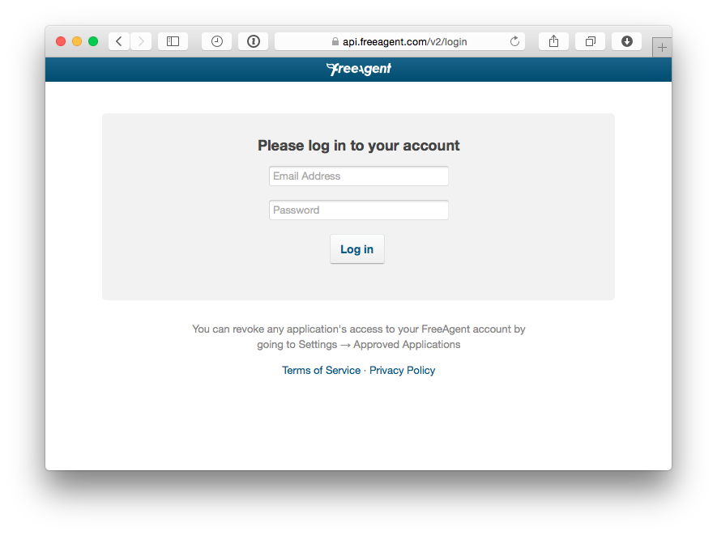

# FreeAgentApi

A simple repository showing how to interact with the FreeAgentAPI with PHP
=======

This is a simple repository, designed for use with the January 2015 edition of [PHP Architect]
(http://phparch.com) magazine’s Education Station column, showing how to interact with the 
FreeAgentAPI using PHP.

## Getting Started

To get started using this repository, you need to have both a [developer](http://dev.freeagent.com) 
and [normal](http://www.freeagent.com) account with FreeAgent. Once you’ve got those setup, 
then you need to create an application. The details aren’t really important, but you’ll need to 
copy the identity and secret values to the respective constants in `src/FreeAgentApi.php`, which 
you can see below.


Following that, from the root of the project, run `composer update` to pull in the dependencies, 
which you can find in composer.json.

## Running The Application

To run the application, the simplest way is to use PHP’s built-in webserver by using the following 
command from the root directory:

```
php -S localhost:8080 -t .
```

Then, in your browser of choice, navigate to `http://localhost:8080`. You’ll then be prompted to 
enter your username and password to allow the app access to your account. 



Enter the credentials of your normal (non-developer) account. Following that, allow the app access.
 


Assuming that authentication works, you’ll then be redirected back to the application. The access
code will be appended to the query string. Currently you need to manually update the URL to navigate
between the various routes. 

In a future update this may be changed so that the code is stored in 
session and a parent template provides links to the various routes. But for now, that’s not available.
